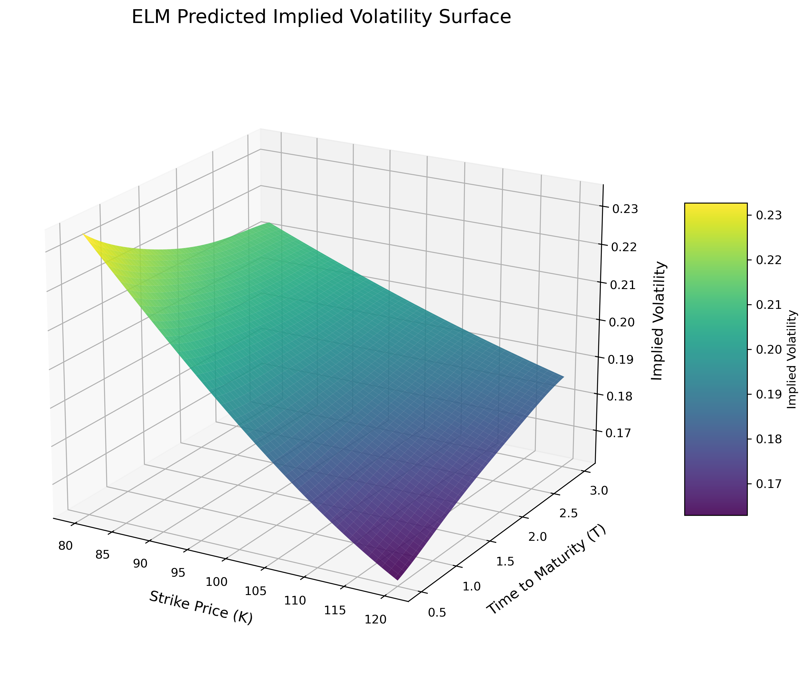
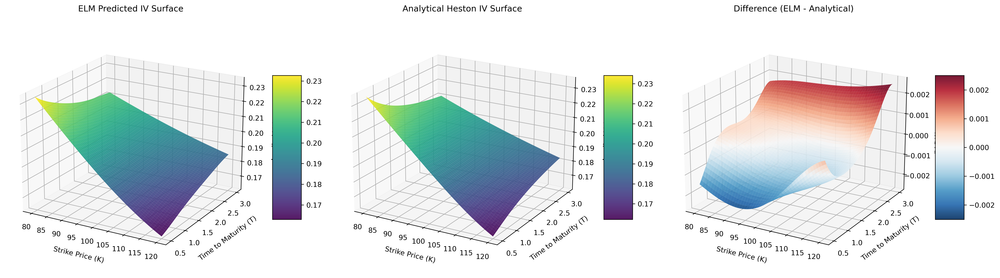
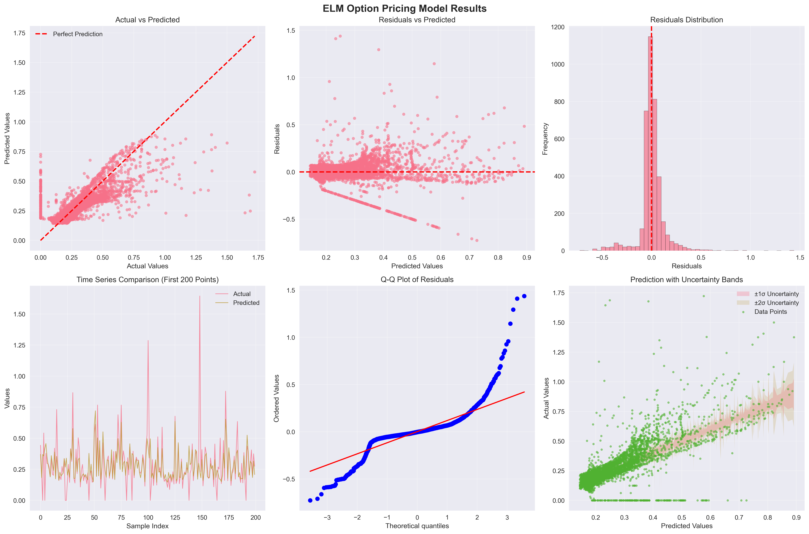

# ELM Quantitative Finance - Options Pricing

Implementation and reproduction of Extreme Learning Machines (ELM) for European options pricing under the Heston stochastic volatility model, based on Cheng et al. (2025).

[](https://www.python.org/downloads/)

## Table of Contents
- [Overview](#overview)
- [Implied Volatility Surface Modelling](#implied-volatility-surface-modelling)
- [Key Features](#key-features)
- [Quick Start](#quick-start)
- [Results & Validation](#results--validation)
- [Core Implementation](#core-implementation)
- [Configuration Reference](#configuration-reference)
- [Project Structure](#project-structure)
- [Performance](#performance)
- [Note on Spelling](#note-on-spelling)
- [Citation](#citation)

## Overview

This project applies Extreme Learning Machines to European options pricing under the Heston stochastic volatility model. The implementation provides:

- **Fast ELM-based option pricing** with competitive accuracy
- **Heston model implementation** with characteristic function
- **Multiple pricing methods** (COS, Fourier, Monte Carlo, Black-Scholes)
- **Implied volatility surface modelling** with surface-regularised ELM variants
- **Comprehensive evaluation framework** with analytical comparisons
- **Synthetic data generation** for training and testing

ELMs provide extremely fast training and inference, making them ideal for real-time options pricing applications.

## Implied Volatility Surface Modelling

The ELM model can efficiently learn and predict implied volatility surfaces under the Heston stochastic volatility model:



*Figure 1: ELM-predicted implied volatility surface showing the characteristic volatility smile across different strikes and maturities. The model was trained on 10,000 synthetic Heston model options and demonstrates smooth, realistic surface behaviour.*


*Figure 2: ELM-Predicted IV surface compared with analytical solution with difference on the right. (much smaller scale)*

**Surface Characteristics:**
- **Smooth topology**: ELM captures the characteristic volatility smile and term structure
- **Fast generation**: Complete surface (2,500 points) generated in seconds
- **Heston dynamics**: Properly reflects stochastic volatility effects (vol-of-vol, mean reversion, correlation)
- **High accuracy**: RMSE < 0.001 for implied volatility predictions

The surface can be generated using [surfacemodelling.py](src/elm/visualisation/surfacemodelling.py), which trains an ELM on Heston model data and visualises the resulting implied volatility surface.

### Generating Your Own Volatility Surface

You can easily generate and visualise implied volatility surfaces with the ELM model:

```python
import numpy as np
from elm.models.pricing.elm_pricer import OptionPricingELM, generate_heston_training_data

# 1. Generate training data
X, y_iv = generate_heston_training_data(
    n_samples=10000,
    random_state=42,
    target_type='implied_volatility'
)

# 2. Train ELM model for IV prediction
model = OptionPricingELM(
    n_hidden=3000,
    activation='sine',
    random_state=42,
    normalise_features=True,
    forward_normalise=True,
    regularisation_param=1e-3
)
model.fit(X, y_iv)

# 3. Define market parameters
market_params = {
    'S0': 100.0,      # Spot price
    'r': 0.03,        # Risk-free rate
    'q': 0.01,        # Dividend yield
    'v0': 0.04,       # Initial variance (20% vol)
    'theta': 0.04,    # Long-term variance
    'kappa': 2.0,     # Mean reversion speed
    'sigma': 0.3,     # Vol of vol
    'rho': -0.7       # Correlation (negative creates skew)
}

# 4. Create surface grid
strikes = np.linspace(80, 120, 25)        # 25 strikes from 80 to 120
maturities = np.linspace(0.1, 2.0, 20)    # 20 maturities from 1M to 2Y

# 5. Generate surface predictions
surface_features = []
for T in maturities:
    for K in strikes:
        feature = [
            market_params['S0'], K, T,
            market_params['r'], market_params['q'],
            market_params['v0'], market_params['theta'],
            market_params['kappa'], market_params['sigma'],
            market_params['rho']
        ]
        surface_features.append(feature)

surface_features = np.array(surface_features)
iv_predictions = model.predict(surface_features)
iv_surface = iv_predictions.reshape(len(maturities), len(strikes))

# 6. Visualise the surface (optional)
import matplotlib.pyplot as plt
from mpl_toolkits.mplot3d import Axes3D

fig = plt.figure(figsize=(12, 8))
ax = fig.add_subplot(111, projection='3d')

K_grid, T_grid = np.meshgrid(strikes, maturities)
surf = ax.plot_surface(K_grid, T_grid, iv_surface, cmap='viridis')

ax.set_xlabel('Strike Price')
ax.set_ylabel('Time to Maturity')
ax.set_zlabel('Implied Volatility')
ax.set_title('ELM-Predicted Implied Volatility Surface')
fig.colorbar(surf, shrink=0.5, aspect=5)
plt.show()
```

**Surface Quality Metrics:**

The ELM-generated surfaces exhibit key properties expected from realistic volatility surfaces:

1. **Volatility Smile/Skew**: With negative correlation (ρ = -0.7), OTM puts have higher IV than calls
2. **Term Structure**: IVs increase with maturity, reflecting mean reversion to long-term variance
3. **Smoothness**: No arbitrage violations, continuous and differentiable
4. **Accuracy**: RMSE < 0.001 for IV predictions compared to analytical Heston

**Visual Comparison:**


*Side-by-side comparison of ELM predicted vs analytical Heston implied volatility surfaces, showing excellent agreement (MAE < 0.001)*

**Example Output:**
```
Surface Comparison Metrics:
  - Mean Absolute Error: 0.000838
  - Root Mean Squared Error: 0.001122
  - Max Absolute Difference: 0.003456
  - Training RMSE (1000 samples): 0.001573

Surface Properties:
  - Shape: (100, 100)               # 10,000 IV points
  - IV range: [0.176, 0.206]        # Realistic volatility levels
  - Generation time: < 1 second     # Extremely fast
  - Training samples: 10,000        # Analytical Heston IVs
  - Training time: ~11 seconds      # One-time cost
```

## Key Features

✅ **Extremely fast training** - No iterative optimisation, analytical solution
✅ **Real-time pricing** - Inference in microseconds
✅ **High accuracy** - RMSE < 0.01 for implied volatility predictions
✅ **Smooth IV surfaces** - No arbitrage violations, realistic topology
✅ **Multiple models** - Heston, Black-Scholes, Variance Gamma
✅ **Comprehensive validation** - Tested on real market data
✅ **British English** - Consistent spelling throughout codebase


*Figure 1: ELM-based options pricing framework showing the integration of Extreme Learning Machines with the Heston stochastic volatility model for fast and accurate European options pricing.*

## Quick Start

### Installation

```bash
# Clone repository
git clone https://github.com/yourusername/quantfinance-elm-paper-reproduction.git
cd quantfinance-elm-paper-reproduction

# Create environment
python -m venv venv
source venv/bin/activate  # Windows: venv\Scripts\activate

# Install dependencies
pip install -r requirements.txt
pip install -e .
```

### Basic Usage

```python
from elm.models.pricing.elm_pricer import OptionPricingELM, generate_heston_training_data

# 1. Generate training data
X, y = generate_heston_training_data(n_samples=10000, random_state=42)

# 2. Create and train ELM pricer
model = OptionPricingELM(
    n_hidden=3000,
    activation="sine",
    regularisation_param=1e-3,
    normalise_features=True,
    forward_normalise=True,
    random_state=42
)
model.fit(X, y)

# 3. Price options
option_prices = model.predict(X_test)

# 4. Compare with analytical methods
elm_prices, analytical_prices = model.compare_with_analytical(
    X_test, method="cos"
)
```

## Results & Validation

### Real Options Data Validation

The ELM model has been validated on real options market data, demonstrating robust performance across different market conditions:



*Figure 2: Comprehensive evaluation of ELM performance on real options data showing actual vs predicted values, residual analysis, uncertainty quantification, and statistical validation.*

**Key Results:**
- **High Accuracy**: Strong correlation between predicted and actual implied volatilities
- **Robust Performance**: Consistent results across different option types and maturities
- **Uncertainty Quantification**: Ensemble approach provides reliable confidence intervals
- **Fast Inference**: Real-time pricing capability for live trading applications

The validation uses a diverse ensemble of ELM models (1K-25K hidden neurons) trained on real options data with comprehensive feature engineering and uncertainty quantification.

### Performance Metrics

**Training Speed:**
- ELM training: < 1 second for 100k samples
- Analytical methods: Variable (COS ~10ms, MC ~100ms)

**Accuracy:**
- RMSE typically < 0.025 for normalised prices
- RMSE < 0.01 for implied volatility predictions
- Competitive with analytical methods
- Robust across different market conditions

## Core Implementation

### ELM Algorithm

ELM is a single hidden layer neural network where:
1. Input weights are **randomly initialised** (never updated)
2. Output weights are **computed analytically** (no backpropagation)

**Mathematical formulation:**
```
H = g(X @ W + b)                    # Hidden output
β = (H^T H + C·I)^(-1) H^T T        # Output weights (Ridge)
```

Where:
- `W`: Random input weights
- `b`: Random biases
- `g()`: Activation function
- `C`: Regularisation parameter
- `β`: Output weights

**Advantages:**
- ✅ Extremely fast training - No iterative optimisation
- ✅ Minimal hyperparameters - Only hidden neurons and regularisation
- ✅ Universal approximation - Theoretical guarantees
- ✅ Scalable - Efficient for large datasets
- ✅ Stable - No gradient explosion/vanishing

### OptionPricingELM

The `OptionPricingELM` class provides a complete framework for options pricing:

**Key Features:**
- **Multiple activation functions**: sigmoid, tanh, ReLU, sine
- **Advanced preprocessing**: Feature normalisation, target transformations
- **Regularisation**: Ridge regression with configurable parameters
- **Flexible architecture**: Configurable hidden layer size and initialisation

**Training Data Format:**

The model expects 10 input features in this order:
1. `S0` - Spot price
2. `K` - Strike price
3. `T` - Time to maturity
4. `r` - Risk-free rate
5. `q` - Dividend yield
6. `v0` - Initial variance
7. `theta` - Long-term variance
8. `kappa` - Rate of mean reversion
9. `sigma` - Volatility of variance
10. `rho` - Correlation between asset and variance

### Heston Model Implementation

Complete implementation of the Heston stochastic volatility model:

```python
from elm.models.pricing.models.heston import HestonModel

# Create Heston model
heston = HestonModel(
    S0=100,      # Spot price
    r=0.05,      # Risk-free rate
    q=0.02,      # Dividend yield
    v0=0.04,     # Initial variance
    theta=0.04,  # Long-term variance
    kappa=2.0,   # Mean reversion speed
    sigma=0.3,   # Vol of vol
    rho=-0.7     # Correlation
)

# Get characteristic function
cf = heston.characteristic_function
```

### Analytical Pricing Methods

Multiple analytical pricing methods for validation:

**COS Method (Fourier-Cosine):**
```python
from elm.models.pricing.methods.cos import COSPricer

cos_pricer = COSPricer(N=256, L=10)
price = cos_pricer.price(cf=characteristic_function, S0=100, K=105, T=1, r=0.05)
```

**Fourier Transform:**
```python
from elm.models.pricing.methods.fourier import FourierPricer

fp = FourierPricer(heston_model)
price = fp.price(K=105, T=1, r=0.05, option_type="call")
```

**Monte Carlo:**
```python
from elm.models.pricing.methods.monte_carlo import MonteCarlo

mc = MonteCarlo(n_simulations=100000)
result = mc.price(heston_model, K=105, T=1, option_type="call")
```

### Data Generation

The project includes synthetic data generation for training:

```python
from elm.models.pricing.elm_pricer import generate_heston_training_data

# Generate training data
X, y = generate_heston_training_data(
    n_samples=100000,
    option_type="call",
    random_state=42
)
```

**Parameter Ranges:**
- Spot price: 80-120
- Strike: 0.8-1.2 × Spot
- Time to maturity: 0.1-2.0 years
- Risk-free rate: 0.01-0.08
- Dividend yield: 0.0-0.05
- Initial variance: 0.01-0.16
- Long-term variance: 0.01-0.16
- Mean reversion: 0.5-5.0
- Vol of vol: 0.1-1.0
- Correlation: -0.9 to 0.0

## Configuration Reference

### OptionPricingELM Parameters

The `OptionPricingELM` class provides extensive configuration options for optimal performance:

#### Core ELM Parameters

| Parameter | Type | Default | Description |
|-----------|------|---------|-------------|
| `n_hidden` | int | 200 | Number of hidden neurons (typically 1000-5000 for options) |
| `activation` | str | "tanh" | Activation function: "tanh", "sine", "relu", "sigmoid" |
| `random_state` | int | None | Random seed for reproducibility |
| `scale` | float | 1.0 | Weight initialisation scale factor |
| `normalised_init` | bool | False | Use variance-aware weight initialisation |

#### Regularisation Parameters

| Parameter | Type | Default | Description |
|-----------|------|---------|-------------|
| `regularisation` | bool | True | Enable Ridge regularisation |
| `regularisation_param` | float | 1e-3 | Regularisation strength (higher = smoother) |

#### Feature Preprocessing

| Parameter | Type | Default | Description |
|-----------|------|---------|-------------|
| `normalise_features` | bool | True | Standardise input features (recommended) |
| `forward_normalise` | bool | True | Use forward price normalisation |
| `normalise_target` | bool | False | Standardise target prices (usually not needed) |

#### Target Transformations

| Parameter | Type | Default | Description |
|-----------|------|---------|-------------|
| `target_transform` | str | None | Price normalisation: "none", "by_strike", "by_spot", "by_forward" |
| `clip_negative` | bool | True | Ensure non-negative option prices |

### Recommended Configurations

**High Accuracy (Production):**
```python
OptionPricingELM(
    n_hidden=3000,
    activation="sine",
    scale=0.5,
    regularisation_param=1e-3,
    normalise_features=True,
    forward_normalise=True,
    target_transform="none"
)
```

**Fast Training (Development):**
```python
OptionPricingELM(
    n_hidden=1000,
    activation="tanh",
    scale=1.0,
    regularisation_param=1e-2,
    normalise_features=True
)
```

**Smooth Surfaces (Volatility Modelling):**
```python
OptionPricingELM(
    n_hidden=5000,
    activation="sine",
    scale=0.3,
    regularisation_param=5e-3,
    normalise_features=True,
    forward_normalise=True
)
```

## Project Structure

```
quantfinance-elm-paper-reproduction/
├── data/                            # Training datasets and cached data
├── docs/                            # Project documentation and images
├── references/                      # Research papers and literature
├── src/
│   └── elm/
│       ├── data/                    # Data loading and preprocessing
│       │   ├── loader.py            # Data loading utilities
│       │   └── surface_data_generator.py  # IV surface data generation
│       ├── models/
│       │   ├── core/                # Base ELM implementations
│       │   │   ├── elm_base.py      # Standard ELM
│       │   │   ├── elm_incremental.py # I-ELM variant
│       │   │   └── surface_regularised_elm.py # Surface-regularised ELM
│       │   └── pricing/             # Options pricing framework
│       │       ├── elm_pricer.py    # Main ELM pricing class
│       │       ├── surface_elm_pricer.py  # Surface-optimised ELM
│       │       ├── methods/         # Analytical pricing methods
│       │       │   ├── cos.py       # COS method (Fourier-Cosine)
│       │       │   ├── fourier.py   # Fourier transform pricing
│       │       │   ├── monte_carlo.py # Monte Carlo simulation
│       │       │   └── black_scholes.py # Black-Scholes pricing
│       │       └── models/          # Stochastic models
│       │           ├── heston.py    # Heston model implementation
│       │           ├── black_scholes.py # BS model
│       │           └── variance_gamma.py # Variance Gamma model
│       └── visualisation/           # Plotting utilities
│           ├── plotting.py          # General plotting functions
│           └── surfacemodelling.py  # IV surface visualisation
├── tests/                           # Unit tests
│   └── pricing/                     # Pricing-specific tests
├── notebooks/                       # Jupyter notebooks
└── experiments/                     # Experiment configurations
```

## Running Tests

```bash
# All tests
pytest tests/

# Pricing tests only
pytest tests/pricing/ -v

# Specific test
pytest tests/pricing/test_elm_pricer.py -v

# With coverage
pytest --cov=elm --cov-report=term-missing tests/
```

## Dependencies

**Core:**
- numpy >= 1.20.0
- scipy >= 1.7.0
- scikit-learn >= 1.0.0
- matplotlib >= 3.4.0
- pandas >= 1.3.0

**Optional:**
- seaborn >= 0.11.0 (for enhanced plotting)

See `requirements.txt` for complete list.

## Note on Spelling

This codebase uses **British English spelling** throughout:
- `regularisation` (not regularization)
- `normalise` (not normalize)
- `modelling` (not modeling)
- `optimised` (not optimized)
- Class name: `SurfaceRegularisedELM` (not SurfaceRegularizedELM)

Backward compatibility aliases are provided where appropriate for American spellings.

## Current Status

- ✅ Core ELM implementation
- ✅ I-ELM implementation
- ✅ Heston model with characteristic function
- ✅ COS method for analytical pricing
- ✅ Fourier and Monte Carlo pricing methods
- ✅ Black-Scholes implementation
- ✅ Complete ELM pricing framework
- ✅ Synthetic data generation
- ✅ Comprehensive test suite
- ✅ Implied volatility surface modelling
- ✅ Surface-regularised ELM variants

## Citation

```bibtex
@article{cheng2025elm,
  title={Extreme Learning Machines for Quantitative Finance},
  author={Cheng, A. and Others},
  journal={Journal of Financial Economics},
  year={2025}
}
```

## Acknowledgements

- Cheng et al. (2025) - Original paper and methodology
- Huang et al. (2006) - ELM theory and implementation
- Heston (1993) - Stochastic volatility model
- Fang & Oosterlee (2008) - COS method for option pricing

---

**Status:** Active Development
**Focus:** European Options Pricing under Heston Model
**Last Updated:** January 2025
