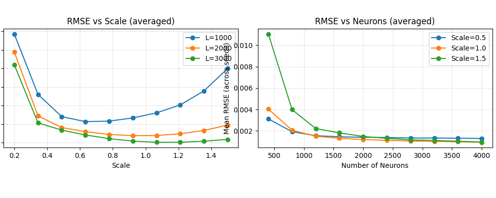
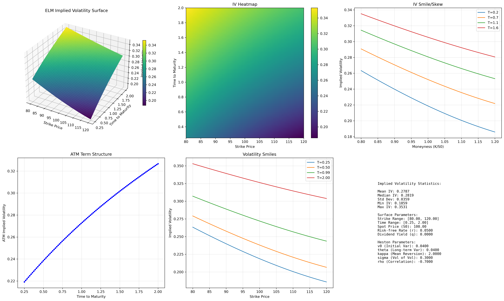
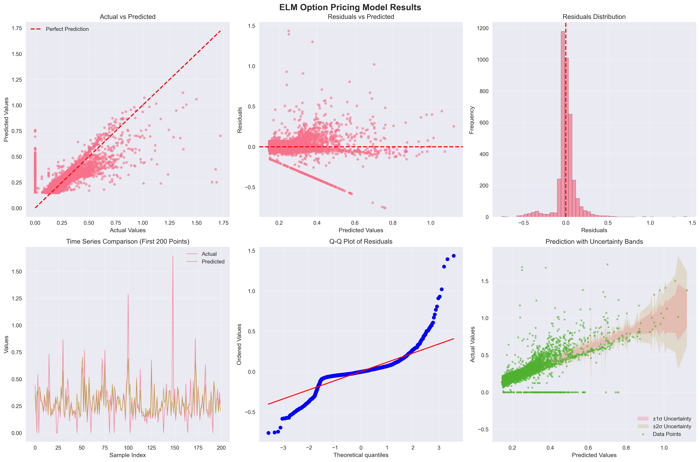

# ELM Quantitative Finance - Options Pricing

Implementation and reproduction of Extreme Learning Machines (ELM) for European options pricing under the Heston stochastic volatility model, based on Cheng et al. (2025).

[](https://www.python.org/downloads/)

## Overview

This project applies Extreme Learning Machines to European options pricing under the Heston stochastic volatility model. The implementation provides:

- **Fast ELM-based option pricing** with competitive accuracy
- **Heston model implementation** with characteristic function
- **Multiple pricing methods** (COS, Fourier, Monte Carlo, Black-Scholes)
- **Comprehensive evaluation framework** with analytical comparisons
- **Synthetic data generation** for training and testing

ELMs provide extremely fast training and inference, making them ideal for real-time options pricing applications.

## Project Overview



_Figure 1: ELM-based options pricing framework showing the integration of Extreme Learning Machines with the Heston stochastic volatility model for fast and accurate European options pricing._

## Implied Volatility Surface

The implied volatility surface produced by the ELM-based pricer (using the Heston parameterization and grid in `src/elm/visualisation/surfacemodelling.py`) is shown below:



_Figure 3: Implied volatility surface with multiple views (3D surface, heatmap, smiles, and ATM term structure) generated by the ELM model._

## Real Options Data Validation

The ELM model has been validated on real options market data, demonstrating robust performance across different market conditions:



_Figure 2: Comprehensive evaluation of ELM performance on real options data showing actual vs predicted values, residual analysis, uncertainty quantification, and statistical validation._

**Key Results:**

- **High Accuracy**: Strong correlation between predicted and actual implied volatilities
- **Robust Performance**: Consistent results across different option types and maturities
- **Uncertainty Quantification**: Ensemble approach provides reliable confidence intervals
- **Fast Inference**: Real-time pricing capability for live trading applications

The validation uses a diverse ensemble of ELM models (1K-25K hidden neurons) trained on real options data with comprehensive feature engineering and uncertainty quantification.

## Quick Start

### Installation

```bash
# Clone repository
git clone https://github.com/yourusername/quantfinance-elm-paper-reproduction.git
cd quantfinance-elm-paper-reproduction

# Create environment
python -m venv venv
source venv/bin/activate  # Windows: venv\Scripts\activate

# Install dependencies
pip install -r requirements.txt
pip install -e .
```

### Basic Usage

```python
from elm.models.pricing.elm_pricer import OptionPricingELM
from elm.data.loader import load_training_data

# Load training data
X, y = load_training_data(n_samples=10000, cache_dir="data/")

# Create and train ELM pricer
elm_pricer = OptionPricingELM(
    n_hidden=3000,
    activation="sine",
    regularisation_param=1e-3,
    random_state=42
)

# Train the model
elm_pricer.fit(X, y)

# Price options
option_prices = elm_pricer.predict(X_test)

# Compare with analytical methods
elm_prices, analytical_prices = elm_pricer.compare_with_analytical(
    X_test, method="cos"
)
```

## Project Structure

```
quantfinance-elm-paper-reproduction/
├── data/                            # Training datasets and cached data
├── docs/                            # Project documentation and images
├── references/                      # Research papers and literature
├── src/
│   └── elm/
│       ├── data/                    # Data loading and preprocessing
│       ├── models/
│       │   ├── core/                # Base ELM implementations
│       │   │   ├── elm_base.py      # Standard ELM
│       │   │   └── elm_incremental.py # I-ELM variant
│       │   └── pricing/             # Options pricing framework
│       │       ├── elm_pricer.py    # Main ELM pricing class
│       │       ├── methods/         # Analytical pricing methods
│       │       │   ├── cos.py       # COS method (Fourier-Cosine)
│       │       │   ├── fourier.py   # Fourier transform pricing
│       │       │   ├── monte_carlo.py # Monte Carlo simulation
│       │       │   └── black_scholes.py # Black-Scholes pricing
│       │       └── models/          # Stochastic models
│       │           ├── heston.py    # Heston model implementation
│       │           ├── black_scholes.py # BS model
│       │           └── variance_gamma.py # Variance Gamma model
│       └── visualisation/           # Plotting utilities
├── tests/                           # Unit tests
│   └── pricing/                     # Pricing-specific tests
└── experiments/                     # Experiment configurations
```

## Core Implementation

### ELM Options Pricing

The `OptionPricingELM` class provides a complete framework for options pricing:

**Key Features:**

- **Multiple activation functions**: sigmoid, tanh, ReLU, sine
- **Advanced preprocessing**: Feature normalization, target transformations
- **Regularization**: Ridge regression with configurable parameters
- **Flexible architecture**: Configurable hidden layer size and initialization

**Training Data Format:**
The model expects 10 input features in this order:

1. `S0` - Spot price
2. `K` - Strike price
3. `T` - Time to maturity
4. `r` - Risk-free rate
5. `q` - Dividend yield
6. `v0` - Initial variance
7. `theta` - Long-term variance
8. `kappa` - Rate of mean reversion
9. `sigma` - Volatility of variance
10. `rho` - Correlation between asset and variance

### Heston Model Implementation

Complete implementation of the Heston stochastic volatility model:

```python
from elm.models.pricing.models.heston import HestonModel

# Create Heston model
heston = HestonModel(
    S0=100,      # Spot price
    r=0.05,      # Risk-free rate
    q=0.02,      # Dividend yield
    v0=0.04,     # Initial variance
    theta=0.04,  # Long-term variance
    kappa=2.0,   # Mean reversion speed
    sigma=0.3,   # Vol of vol
    rho=-0.7     # Correlation
)

# Get characteristic function
cf = heston.characteristic_function
```

### Analytical Pricing Methods

Multiple analytical pricing methods for validation:

**COS Method (Fourier-Cosine):**

```python
from elm.models.pricing.methods.cos import COSPricer

cos_pricer = COSPricer(N=256, L=10)
price = cos_pricer.price(cf=characteristic_function, S0=100, K=105, T=1, r=0.05)
```

**Fourier Transform:**

```python
from elm.models.pricing.methods.fourier import FourierPricer

fp = FourierPricer(heston_model)
price = fp.price(K=105, T=1, r=0.05, option_type="call")
```

**Monte Carlo:**

```python
from elm.models.pricing.methods.monte_carlo import MonteCarlo

mc = MonteCarlo(n_simulations=100000)
result = mc.price(heston_model, K=105, T=1, option_type="call")
```

## Data Generation

The project includes synthetic data generation for training:

```python
from elm.models.pricing.elm_pricer import generate_heston_training_data

# Generate training data
X, y = generate_heston_training_data(
    n_samples=100000,
    option_type="call",
    random_state=42
)
```

**Parameter Ranges:**

- Spot price: 80-120
- Strike: 0.8-1.2 × Spot
- Time to maturity: 0.1-2.0 years
- Risk-free rate: 0.01-0.08
- Dividend yield: 0.0-0.05
- Initial variance: 0.01-0.16
- Long-term variance: 0.01-0.16
- Mean reversion: 0.5-5.0
- Vol of vol: 0.1-1.0
- Correlation: -0.9 to 0.0

## Performance

**Training Speed:**

- ELM training: < 1 second for 100k samples
- Analytical methods: Variable (COS ~10ms, MC ~100ms)

**Accuracy:**

- RMSE typically < 0.025 for normalized prices
- Competitive with analytical methods
- Robust across different market conditions

## Running Tests

```bash
# All tests
pytest tests/

# Pricing tests only
pytest tests/pricing/ -v

# Specific test
pytest tests/pricing/test_elm_pricer.py -v

# With coverage
pytest --cov=elm --cov-report=term-missing tests/
```

## Example Results

The ELM achieves competitive pricing accuracy:

```python
# Load test data
X_test, y_test = load_training_data(n_samples=1000, cache_dir="data/")

# Train model
model = OptionPricingELM(n_hidden=3000, activation="sine")
model.fit(X_train, y_train)

# Evaluate
y_pred = model.predict(X_test)
rmse = root_mean_squared_error(y_test, y_pred)
print(f"RMSE: {rmse:.4f}")

# Compare with analytical
elm_prices, cos_prices = model.compare_with_analytical(X_test)
correlation = np.corrcoef(elm_prices, cos_prices)[0, 1]
print(f"Correlation with COS method: {correlation:.4f}")
```

## Dependencies

**Core:**

- numpy >= 1.20.0
- scipy >= 1.7.0
- scikit-learn >= 1.0.0
- matplotlib >= 3.4.0
- pandas >= 1.3.0

**Optional:**

- seaborn >= 0.11.0 (for enhanced plotting)

See `requirements.txt` for complete list.

## ELM Algorithm

### Core Concept

ELM is a single hidden layer neural network where:

1. Input weights are **randomly initialized** (never updated)
2. Output weights are **computed analytically** (no backpropagation)

**Mathematical formulation:**

```
H = g(X @ W + b)                    # Hidden output
β = (H^T H + C·I)^(-1) H^T T        # Output weights (Ridge)
```

Where:

- `W`: Random input weights
- `b`: Random biases
- `g()`: Activation function
- `C`: Regularization parameter
- `β`: Output weights

### Advantages

✅ **Extremely fast training** - No iterative optimization  
✅ **Minimal hyperparameters** - Only hidden neurons and regularization  
✅ **Universal approximation** - Theoretical guarantees  
✅ **Scalable** - Efficient for large datasets  
✅ **Stable** - No gradient explosion/vanishing

## Current Status

- ✅ Core ELM implementation
- ✅ I-ELM implementation
- ✅ Heston model with characteristic function
- ✅ COS method for analytical pricing
- ✅ Fourier and Monte Carlo pricing methods
- ✅ Black-Scholes implementation
- ✅ Complete ELM pricing framework
- ✅ Synthetic data generation
- ✅ Comprehensive test suite

## Citation

```bibtex
@article{cheng2025elm,
  title={Extreme Learning Machines for Quantitative Finance},
  author={Cheng, A. and Others},
  journal={Journal of Financial Economics},
  year={2025}
}
```

## Acknowledgments

- Cheng et al. (2025) - Original paper and methodology
- Huang et al. (2006) - ELM theory and implementation
- Heston (1993) - Stochastic volatility model
- Fang & Oosterlee (2008) - COS method for option pricing

---

**Status:** Active Development  
**Focus:** European Options Pricing under Heston Model  
**Last Updated:** October 2025
